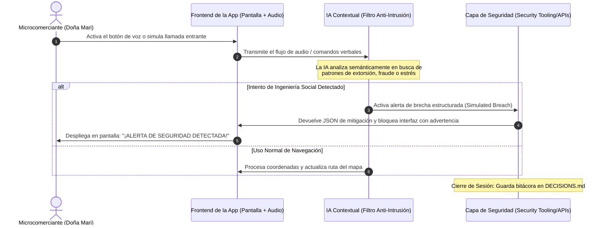

# PACKET: Sistema de Rutas Confiables y Escudo Antifraude por Voz para Microcomerciantes

## 1. El Problema en Mis Propias Palabras
Los microcomerciantes informales que operan en la calle (como Doña Mari) no solo enfrentan riesgos de infraestructura vial, sino que son altamente vulnerables a la ingeniería social, fraudes telefónicos y extorsiones mientras trabajan. Al no contar con un equipo de seguridad técnica, necesitan que su aplicación de navegación habitual actúe como un escudo activo que identifique y bloquee intentos de engaño o amenazas verbales en tiempo real sin interrumpir su logística de entrega.

## 2. Definición de Éxito Exacto del Usuario
"Antes de que el módulo de entrenamiento o sesión de simulación actual se cierre, el sistema debe ser capaz de procesar un comando de voz del usuario o una llamada simulada, detectar indicadores de fraude o coacción mediante IA contextual, activar un protocolo de defensa en pantalla y registrar los metadatos estructurados del incidente de seguridad."

## 3. Flujo del Proceso (Diagrama de Mermaid)

## 4. La Línea de Referencia (Benchmark Line)
* **La mejor solución existente en la Tierra para esto es:** Aplicaciones de identificación de llamadas como Truecaller o escudos de software empresariales independientes.
* **Mi solución difiere o se localiza por:** Integrar la defensa contra ingeniería social nativamente dentro del asistente de voz de una aplicación logística, adaptada al lenguaje coloquial de comerciantes callejeros sin requerir software técnico adicional.

## 5. Light Charter (Visión a Largo Plazo)
En tres años, este componente se convertirá en un estándar de protección comunitaria descentralizada para el comercio informal en América Latina. La aplicación no solo protegerá al usuario individual, sino que creará una red de alerta temprana que mapee zonas de extorsión telefónica en tiempo real mediante datos agregados y anonimizados. Esto transformará a las víctimas vulnerables en defensores activos de su propia seguridad económica.

## 6. Corte de Telescopio (Lo que NO estamos construyendo)
* **NO** estamos construyendo un antivirus general para el teléfono móvil.
* **NO** estamos desarrollando un gestor de contraseñas o bóveda de credenciales.
* **NO** estamos integrando sistemas de autenticación bancaria de grado corporativo de manera real en esta fase.

## 7. Arquitectura y Tabla de Stack (Dragon Stack)

| Capa | Tecnología | Rol en el Proyecto |
| :--- | :--- | :--- |
| **Frontend de Geodatos** | HTML5 Canvas / CSS Custom Properties | Renderiza el mapa, la ruta adaptativa y los paneles visuales de auditoría. |
| **Lógica Adaptativa / ML** | JavaScript Predictivo Local | Recalcula desviaciones viales e inyecta incidentes simulados en el mapa. |
| **Componente Extra (Voz)** | Web Speech API (SpeechRecognition) | Captura de forma asíncrona la voz de Doña Mari en lenguaje urbano. |
| **Filtro de Seguridad (IA)** | Analizador Semántico Contextual LLM | Evalúa las transcripciones para identificar amenazas o fraudes de ingeniería social. |
| **Despliegue Estático** | Vercel | Alojamiento ágil en la nube y configuración blindada de variables de entorno. |

## 8. Plan de Pruebas (Test Plan)
* **Caso de Prueba 1 (Detección de Fraude por Voz):** El usuario activa el micrófono e indica una frase de coacción o extorsión (ej. *"Me están pidiendo dinero, patrón"*). El sistema debe cambiar inmediatamente el estatus a "Brecha Detectada", desplegar una alerta visual roja y actualizar el bloque JSON con el tipo de ataque etiquetado.
* **Caso de Prueba 2 (Sanitización del Input del Formulario):** Se ingresa una cadena con caracteres especiales o comandos de inyección en el cuadro de texto. El validador frontend debe truncar o limpiar el texto antes de procesarlo, evitando que altere la lógica de la aplicación.
